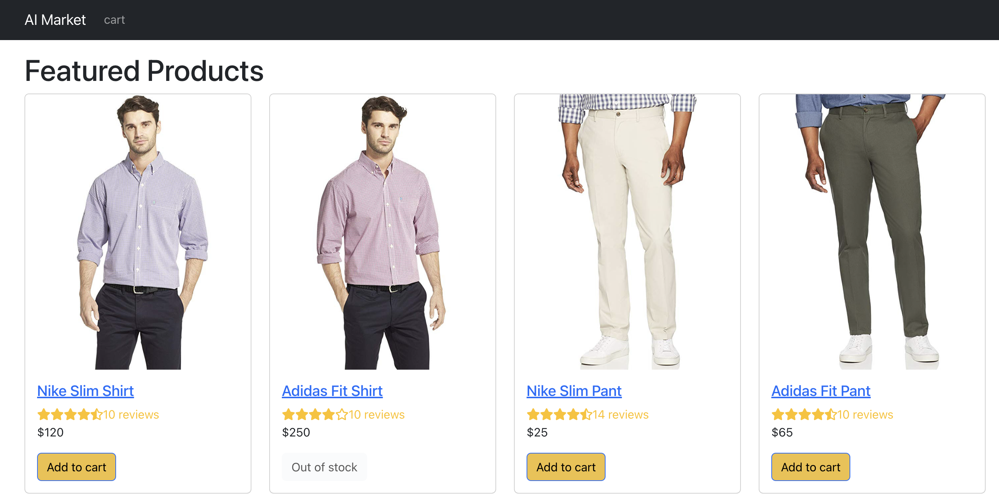
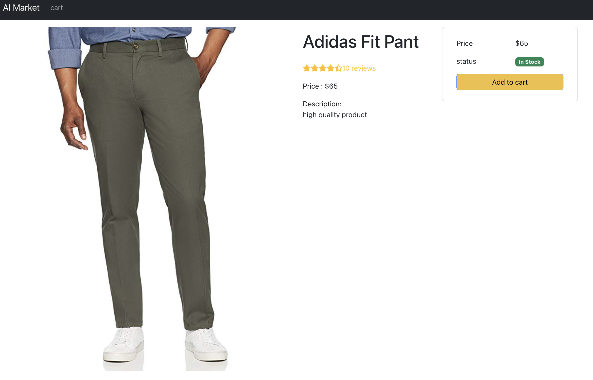

# AI-Market: Build Amazon-Inspired ECommerce Website

This project is designed, created and maintained by Chen Zhang, a full-stack software engineer using MERN stacks: MongoDB Atlas, ExpressJS, ReactJS, and NodeJS.

Welcome to AI-Market, a Amazon-Inspired Ecommerce Website for selling items. This ecommerce website aims at selling products like Amazon. The homepage of AI Market looks like below:

Each item shows picture, reivews and cost with an 'add to cart' button if the item is in stock. Once click on each item, the item detail is displayed.

Items can be added to cart if the amount is available. The customer can adjust the amount or delete the whole item on the shopping cart page, with the total value calculated and shown on the topright.

The customer is able to login and proceed to checkout procedure. An encrpyted database implemented by bcrpyt.js is used for the security purposes.

For any questions, feel free to contact Chen Zhang through chen.zhang06@gmail.com.
